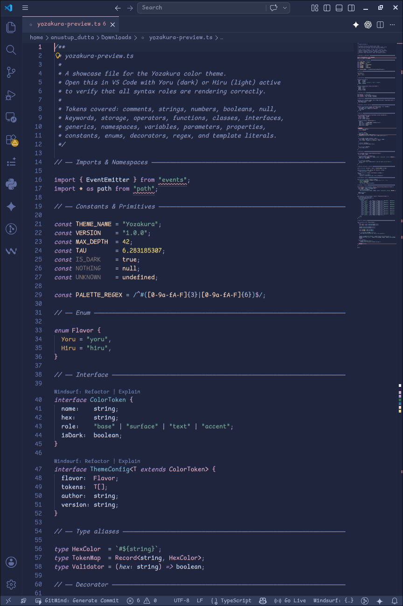
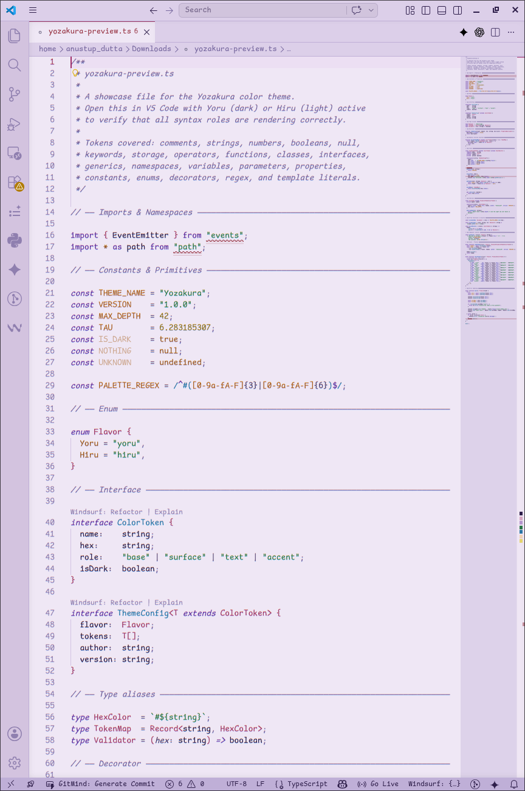

<div align="center">


# 夜桜 Yozakura — VS Code Theme

A handcrafted dual-variant color theme for [Visual Studio Code](https://code.visualstudio.com/), based on the [Yozakura](https://shunsui18.github.io/yozakura) palette.

[](LICENSE)
[](https://code.visualstudio.com/)
[](https://marketplace.visualstudio.com/publishers/shunsui18)
[](https://github.com/shunsui18/yozakura)

</div>

---

## ✦ Variants

| | Variant | Description |
|---|---|---|
| 🌙 | **Yoru** *(night)* | Deep navy night theme with soft blush, lavender, and warm gold accents |
| ☀️ | **Hiru** *(day)* | Light lavender day theme with rich violet, rose, and amber accents |

---

## ✦ Previews

<table>
<tr>
<td align="center"><b>🌙 Yoru</b></td>
<td align="center"><b>☀️ Hiru</b></td>
</tr>
<tr>
<td></td>
<td></td>
</tr>
</table>

---

## ✦ Installation

### Marketplace

Visit the [Extention page](https://marketplace.visualstudio.com/items?itemName=shunsui18.yozakura-vsode-colorscheme) on the VS Code Marketplace and click **Install**.

### Extensions Panel

Search **Yozakura** in the Extensions panel (`Ctrl+Shift+X`) and click **Install**.

### Command Line

```bash
code --install-extension shunsui18.yozakura
```

### Quick Open

Press `Ctrl+P`, paste the following, and press `Enter`:

```
ext install shunsui18.yozakura
```

---

## ✦ Activating the Theme

1. Open the Command Palette (`Ctrl+Shift+P` / `Cmd+Shift+P`)
2. Type **Color Theme**
3. Select **Yozakura Yoru** or **Yozakura Hiru**

Or navigate to **File → Preferences → Color Theme**.

---

## ✦ Palette Reference

### Yoru *(night)*

| Role | Token | Hex |
|---|---|---|
| Background | Void | `#18203a` |
| Editor bg | Depths | `#1e2840` |
| Surface | Base | `#2a3450` |
| Foreground | Text | `#d0daf0` |
| Muted text | Muted | `#b0bcd8` |
| Subtle text | Faint | `#9098c0` |
| Accent (pink) | Blush | `#d8aac4` |
| Accent (purple) | Petal | `#b898d0` |
| Accent (blue) | Indigo | `#6080b8` |
| Accent (cyan) | Sky | `#7ab0c8` |
| Accent (green) | Moss | `#7aa898` |
| Accent (gold) | Starlight | `#e8d870` |
| Accent (rose) | Bloom | `#e098a0` |
| Cursor | — | `#e098a0` |

### Hiru *(day)*

| Role | Token | Hex |
|---|---|---|
| Background | Base | `#f0e8f5` |
| Editor bg | Raised | `#ead8f2` |
| Foreground | Text | `#2a1848` |
| Muted text | Muted | `#4e3e6e` |
| Subtle text | Faint | `#7868a0` |
| Accent (rose) | Blush | `#a03868` |
| Accent (purple) | Iris | `#6030a0` |
| Accent (blue) | Indigo | `#2858b8` |
| Accent (cyan) | Sky | `#2878a8` |
| Accent (green) | Moss | `#287848` |
| Accent (gold) | Starlight | `#887018` |
| Accent (bloom) | Bloom | `#a02868` |
| Cursor | — | `#a02868` |

---

<div align="center">

crafted with 🌸 by [shunsui18](https://github.com/shunsui18)

</div>